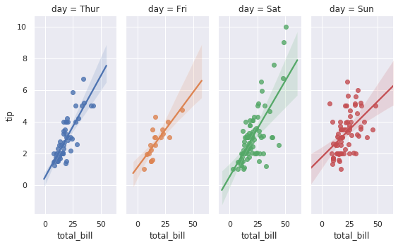
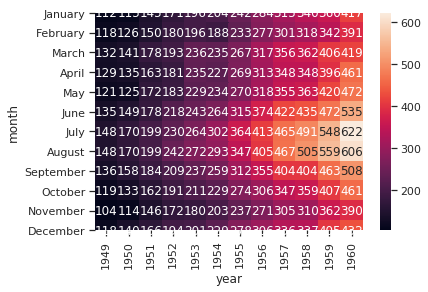

# Seaborn
--------------------
<!-- TOC -->

- [Seaborn](#seaborn)
- [一.概念](#一概念)
    - [1分组绘图](#1分组绘图)
    - [2.分面绘图](#2分面绘图)
    - [3.统计函数](#3统计函数)
- [二.图形分类](#二图形分类)
    - [1.因子变量绘图](#1因子变量绘图)
        - [1.1箱线图boxplot](#11箱线图boxplot)
        - [1.2小提琴图violinplot](#12小提琴图violinplot)
        - [1.3散点图striplot](#13散点图striplot)
        - [1.4带分布的散点图swarmplot](#14带分布的散点图swarmplot)
        - [1.5直方图barplot](#15直方图barplot)
        - [1.6计数的直方图countplot](#16计数的直方图countplot)
        - [1.7两变量关系图factorplot](#17两变量关系图factorplot)
    - [2. 回归图](#2-回归图)
        - [2.1线性回归图lmplot](#21线性回归图lmplot)
        - [2.2逻辑回归图regplot](#22逻辑回归图regplot)
    - [3. 分布图](#3-分布图)
    - [4. 热力图](#4-热力图)
    - [5.数值分布绘图](#5数值分布绘图)
        - [5.1.直方图distplot](#51直方图distplot)
        - [5.2.双变量关系图 jointplot](#52双变量关系图-jointplot)

<!-- /TOC -->

# 一.概念

## 1分组绘图


```python
#比如说需要在一张图上绘制两条曲线，分别是南方和北方的气温变化，分别用不同的颜色加以区分。在seaborn中用hue参数控制分组绘图
```

## 2.分面绘图


```python
#其实就是在一张纸上划分不同的区域，比如2*2的子区域，在不同的子区域上绘制不同的图形，在matplotlib中就是 add_subplot(2,2,1)，在seaborn中用col参数控制，col的全称是columns，不是color，如果辅助col_wrap参数会更好些。后来发现，col可以控制columns的子图，那么row可以控制rows的子图排列。 
#如果需要分面绘图，应该使用seaborn的FacetGrid对象，seaborn的一般的绘图函数是没有分面这个参数的。
```

## 3.统计函数


```python
#分组绘图的时候，会对分组变量先要用统计函数，然后绘图，比如先计算变量的均值，然后绘制该均值的直方图。统计绘图参数是 estimator，很多情况下默认是numpy.mean。在ggplot2中就大量使用了这种方法。如果不适用统计绘图，就需要先用pandas进行groupby分组汇总，然后用seaborn绘图，多此一举了。
```

# 二.图形分类


```python
#在seaborn中图形大概分这么几类，因子变量绘图，数值变量绘图，两变量关系绘图，时间序列图，热力图，分面绘图等。
```

## 1.因子变量绘图


```python
#在seaborn中图形大概分这么几类，因子变量绘图，数值变量绘图，两变量关系绘图，时间序列图，热力图，分面绘图等。
```

### 1.1箱线图boxplot


```python
#箱线图提供有关数据位置的分散情况
#主要包含六个数据节点,分别是,上边缘,上四分位,中位数,下四分位,下边缘
#超出边界的为异常值
import seaborn as sns
#设置图样类型
sns.set_style('whitegrid')
#导入系统自带tips数据包
tips=sns.load_dataset('tips')
#绘制箱线图
ax=sns.boxplot(x=tips['total_bill'])
#竖着放的箱线图,也就是将x换成y
ax=sns.boxplot(y=tips['total_bill'])

```


```python
#分组绘制箱线图,分组因子是day,在x轴不同位置绘制
ax=sns.boxplot(x='day',y='total_bill',data=tips)
```


```python
#分组箱线图,分子因子是smoker,不同的因子用不同颜色区分,
#palette参数是调色板,hue参数是分子因子名称
#
ax=sns.boxplot(x='day',y='total_bill',hue='smoker',data=tips,palette='Set3')
```


```python
#改变线宽,linewidth参数
ax=sns.boxplot(x='day',y='total_bill',hue='time',data=tips,linewidth=2.5)

```


```python
tips.head(5)

```


<div>
<style scoped>
    .dataframe tbody tr th:only-of-type {
        vertical-align: middle;
    }

    .dataframe tbody tr th {
        vertical-align: top;
    }
    
    .dataframe thead th {
        text-align: right;
    }
</style>
<table border="1" class="dataframe">
  <thead>
    <tr style="text-align: right;">
      <th></th>
      <th>total_bill</th>
      <th>tip</th>
      <th>sex</th>
      <th>smoker</th>
      <th>day</th>
      <th>time</th>
      <th>size</th>
    </tr>
  </thead>
  <tbody>
    <tr>
      <td>0</td>
      <td>16.99</td>
      <td>1.01</td>
      <td>Female</td>
      <td>No</td>
      <td>Sun</td>
      <td>Dinner</td>
      <td>2</td>
    </tr>
    <tr>
      <td>1</td>
      <td>10.34</td>
      <td>1.66</td>
      <td>Male</td>
      <td>No</td>
      <td>Sun</td>
      <td>Dinner</td>
      <td>3</td>
    </tr>
    <tr>
      <td>2</td>
      <td>21.01</td>
      <td>3.50</td>
      <td>Male</td>
      <td>No</td>
      <td>Sun</td>
      <td>Dinner</td>
      <td>3</td>
    </tr>
    <tr>
      <td>3</td>
      <td>23.68</td>
      <td>3.31</td>
      <td>Male</td>
      <td>No</td>
      <td>Sun</td>
      <td>Dinner</td>
      <td>2</td>
    </tr>
    <tr>
      <td>4</td>
      <td>24.59</td>
      <td>3.61</td>
      <td>Female</td>
      <td>No</td>
      <td>Sun</td>
      <td>Dinner</td>
      <td>4</td>
    </tr>
  </tbody>
</table>
</div>


```python
#改变x轴顺序,order参数
ax=sns.boxplot(data=tips,y='tip',x='time', order=["Dinner", "Lunch"])
```


```python
#将数据的每一个变量都绘制一个箱线图,水平放置,参数orient ,参数palette决定样式
iris=sns.load_dataset('iris')
ax=sns.boxplot(data=iris,orient='h',palette='Set2')
```


```python
#箱线图+有分布趋势的散点图
ax=sns.boxplot(x='day',y='total_bill',data=tips)
ax=sns.swarmplot(x='day',y='total_bill',data=tips,color='black')
```


### 1.2小提琴图violinplot


```python
#小提琴图其实是箱线图与核密度图的结合，箱线图展示了分位数的位置，小提琴图则展示了任意位置的密度，通过小提琴图可以知道哪些位置的密度较高。在图中，白点是中位数，黑色盒型的范围是下四分位点到上四分位点，细黑线表示须。
#外部形状即为核密度估计（在概率论中用来估计未知的密度函数，属于非参数检验方法之一）。
```


```python
#设置背景图
sns.set_style('whitegrid')
#绘制小提琴图
sns.violinplot(x='total_bill',data=tips)

```


    <matplotlib.axes._subplots.AxesSubplot at 0x7fbecae16128>


```python
#分组小提琴图,通过x轴分组
ax=sns.violinplot(data=tips,x='day',y='total_bill')
```


```python
#通过hue分组小提琴图,相当于再分组
sns.violinplot(data=tips,x='day',y='total_bill',
               hue='smoker',palette='muted')
```


    <matplotlib.axes._subplots.AxesSubplot at 0x7fbecb142470>


```python
#分组组合小提琴图,相当于将分组的小提琴图,各取一般组合
ax=sns.violinplot(data=tips,x='day',y='total_bill',
                  hue='smoker',palette='muted',split=True)
```


```python
ax=sns.violinplot(x='time',y='tip',data=tips,order=['Dinner','Lunch'])
```


### 1.3散点图striplot


```python
#seaborn中有两个散点图，一个是普通的散点图，另一个是可以看出分布密度的散点图。
```


```python
#普通散点图
ax1 = sns.stripplot(x=tips["total_bill"],jitter=False)
```


```python
#带分布密度的散点图
ax2=sns.swarmplot(x=tips['total_bill'])
```


```python
#分组散点图,jiter设置抖动项
ax1 = sns.stripplot(y="total_bill",x='day',data=tips,jitter=False)
```


```python
#x,y轴交换
ax1 = sns.stripplot(x="total_bill",y='day',data=tips)
```


```python
#分组绘制,相当于分组后再分组,通过hue参数控制
ax=sns.stripplot(x="sex", y="total_bill",hue='day',
                    data=tips, jitter=True)
```


```python
#分开绘制
ax=sns.stripplot(x="day", y="total_bill",hue='smoker',
                    data=tips, jitter=True,split=True)
```


```python
#散点图+小提琴图  inner参数改变小提琴内部
ax=sns.stripplot(x="day", y="total_bill",hue='smoker',
                    data=tips, jitter=True)
ax=sns.violinplot(x='day',y='total_bill',data=tips,color='gray',inner=None)
```


### 1.4带分布的散点图swarmplot


```python
#swarmplt的参数和用法和stripplot的用法是一样的，只是表现形式不一样而已。
```


```python
#单个散点图
ax=sns.swarmplot(tips['total_bill'])
```


```python
#分组散点图
ax=sns.swarmplot(data=tips,y='total_bill',x='day')
```


### 1.5直方图barplot


```python
#直方图的统计函数，默认绘制的是变量的均值 estimator=np.mean
```


```python
#参数ic 取消直方图上方的置信度线
ax=sns.barplot(data=tips,x='day',y='total_bill',ci=0)
```


```python
#分组直方图
ax=sns.barplot(data=tips,x='day',y='total_bill',ci=0,hue='sex')
```


```python
#绘制变量中位数的直方图,estimator指定统计函数 ,
from numpy import median
ax=sns.barplot(data=tips,x='day',y='total_bill',ci=0,estimator=median)
```


```python
#改变主题颜色 palette参数
ax=sns.barplot(data=tips,x='day',y='total_bill',
               ci=0,estimator=median,palette='Blues_d')
```


### 1.6计数的直方图countplot


```python
#对因子变量技术,然后绘制条形图
sns.set(style='darkgrid')
titanic=sns.load_dataset('titanic')
ax=sns.countplot(x='class',data=titanic)
```


```python
# 分组绘图
ax = sns.countplot(x="class", hue="who", data=titanic)
```


```python
#横放
ax = sns.countplot(y="class", hue="who", data=titanic)
```


```python
titanic.head()
```


<div>
<style scoped>
    .dataframe tbody tr th:only-of-type {
        vertical-align: middle;
    }

    .dataframe tbody tr th {
        vertical-align: top;
    }
    
    .dataframe thead th {
        text-align: right;
    }
</style>
<table border="1" class="dataframe">
  <thead>
    <tr style="text-align: right;">
      <th></th>
      <th>survived</th>
      <th>pclass</th>
      <th>sex</th>
      <th>age</th>
      <th>sibsp</th>
      <th>parch</th>
      <th>fare</th>
      <th>embarked</th>
      <th>class</th>
      <th>who</th>
      <th>adult_male</th>
      <th>deck</th>
      <th>embark_town</th>
      <th>alive</th>
      <th>alone</th>
    </tr>
  </thead>
  <tbody>
    <tr>
      <td>0</td>
      <td>0</td>
      <td>3</td>
      <td>male</td>
      <td>22.0</td>
      <td>1</td>
      <td>0</td>
      <td>7.2500</td>
      <td>S</td>
      <td>Third</td>
      <td>man</td>
      <td>True</td>
      <td>NaN</td>
      <td>Southampton</td>
      <td>no</td>
      <td>False</td>
    </tr>
    <tr>
      <td>1</td>
      <td>1</td>
      <td>1</td>
      <td>female</td>
      <td>38.0</td>
      <td>1</td>
      <td>0</td>
      <td>71.2833</td>
      <td>C</td>
      <td>First</td>
      <td>woman</td>
      <td>False</td>
      <td>C</td>
      <td>Cherbourg</td>
      <td>yes</td>
      <td>False</td>
    </tr>
    <tr>
      <td>2</td>
      <td>1</td>
      <td>3</td>
      <td>female</td>
      <td>26.0</td>
      <td>0</td>
      <td>0</td>
      <td>7.9250</td>
      <td>S</td>
      <td>Third</td>
      <td>woman</td>
      <td>False</td>
      <td>NaN</td>
      <td>Southampton</td>
      <td>yes</td>
      <td>True</td>
    </tr>
    <tr>
      <td>3</td>
      <td>1</td>
      <td>1</td>
      <td>female</td>
      <td>35.0</td>
      <td>1</td>
      <td>0</td>
      <td>53.1000</td>
      <td>S</td>
      <td>First</td>
      <td>woman</td>
      <td>False</td>
      <td>C</td>
      <td>Southampton</td>
      <td>yes</td>
      <td>False</td>
    </tr>
    <tr>
      <td>4</td>
      <td>0</td>
      <td>3</td>
      <td>male</td>
      <td>35.0</td>
      <td>0</td>
      <td>0</td>
      <td>8.0500</td>
      <td>S</td>
      <td>Third</td>
      <td>man</td>
      <td>True</td>
      <td>NaN</td>
      <td>Southampton</td>
      <td>no</td>
      <td>True</td>
    </tr>
  </tbody>
</table>
</div>


### 1.7两变量关系图factorplot


```python
#变量联合绘图
#绘制因子变量-数值变量的分布情况图
#用小提琴图反应 class-who 两变量的分布情形
g=sns.factorplot(data=tips,x='day',y='total_bill',hue='sex',kind='violin')
```


```python
#不同的deck(因子)绘制不同的alive(数值),col为分子图绘制,col_wrap每行画4个子图
g=sns.factorplot(x='alive',col='deck',col_wrap=4,
                 data=titanic[titanic.deck.notnull()],
                 kind='count',size=2.5,aspect=.8)
```


## 2. 回归图 


```python
#回归图有两个
#lmplot： Plot data and regression model fits across a FacetGrid. 
#regplot：Plot data and a linear regression model fit.
```

### 2.1线性回归图lmplot


```python
#线性回归图
ax=sns.lmplot(x="total_bill", y="tip", data=tips)
```


```python
# 分组的线性回归图，通过hue参数控制
g = sns.lmplot(x="total_bill", y="tip", hue="smoker", data=tips)
```


```python
#分组绘图,不同的组用不同的形状标记
g = sns.lmplot(x="total_bill", y="tip",
               hue="smoker", data=tips,markers=['^','x'])
```


```python
#分开分组绘图
g = sns.lmplot(x="total_bill", y="tip",
               col="smoker", data=tips)
```


```python
#col+hue 双分组参数,即分组,又分子图绘图
g = sns.lmplot(x="total_bill", y="tip",hue='day',
               col="day", data=tips,aspect=.4)
```





```python
# 分组绘制，控制size尺寸
g = sns.lmplot(x="total_bill", y="tip", col="day", hue="day",
                data=tips, col_wrap=2, size=3)
```


### 2.2逻辑回归图regplot


```python
#绘制逻辑回归图
ax = sns.regplot(x="total_bill", y="tip", data=tips)
```


```python
#控制散点的形状和颜色 参数color,marker
ax = sns.regplot(x="total_bill", y="tip", data=tips,marker='+',color='r')
```


```python
#控制回归的置信度,拟合直线的外面的面积有变化
ax = sns.regplot(x="total_bill", y="tip", data=tips,marker='+',color='g',ci=68)
```


## 3. 分布图 


```python
#拟合二次曲线通过参数order=2设置
#拟合一次曲线 参数order=1
ans = sns.load_dataset("anscombe")
ax=sns.regplot(x='x',y='y',data=ans.loc[ans.dataset=='II'],order=2)
```


## 4. 热力图 


```python
#热力图表示两两因子间的相关性
import numpy as np
import seaborn as sns
uniform_data=np.random.rand(10,12)
ax=sns.heatmap(uniform_data)
```


```python
#改变颜色范围
ax=sns.heatmap(uniform_data,vmin=1,vmax=0)
```


```python
# 绘制x-y-z的热力图，比如 年-月-销量 的热力图
flights=sns.load_dataset('flights')
flights = flights.pivot("month", "year", "passengers")
ax=sns.heatmap(flights)

```


```python
#绘制热力图,将数值写到热力图上
ax=sns.heatmap(flights,annot=True,fmt='d')
```





## 5.数值分布绘图

### 5.1.直方图distplot


```python
#绘制数值变量的密度分布图
#默认既绘制核密度曲线,也绘制直方图
#直方图hist=True，核密度曲线rug=True
sns.set(rc={'figure.figsize':(8,4)})
x=np.random.randn(100)
ax=sns.distplot(x)
```


```python
#只绘制核密度曲线,不绘制直方图
x=sns.distplot(x,hist=False,rug=True)
```


### 5.2.双变量关系图 jointplot


```python
#多变量联合,kind参数可以使用不同的图形反应两变量的关系，比如点图，线图，核密度图。
```


```python
sns.set(style='white')
g=sns.jointplot(x='total_bill',y='tip',data=tips)
```


```python
# 通过kind参数，除了绘制散点图，还要绘制拟合的直线，拟合的核密度图
g = sns.jointplot("total_bill", "tip", data=tips, kind="reg")
```


```python

```


```python

```


```python

```


```python

```


```python

```
